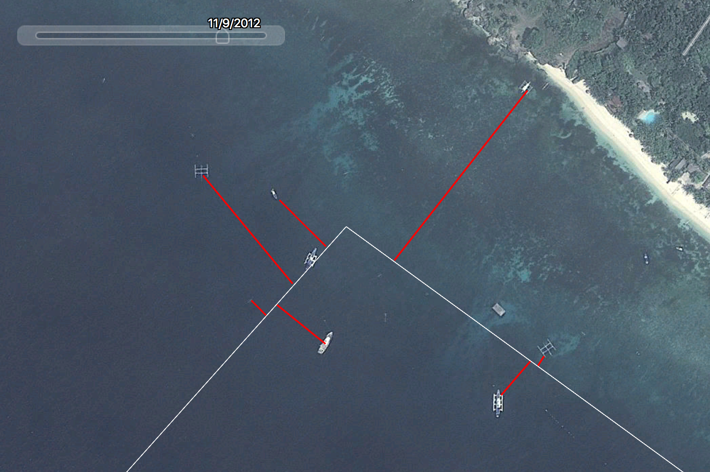

## R Markdown information 
When you click the **Knit** button, a document will be generated that includes both content as well as the output of any embedded R code chunks within the document. You can embed an R code chunk like this:

```{r cars}
summary(cars)
```

Try pressing the **Knit** button now to see what this looks like.

```{r setup, include=FALSE}
# This is the 'setup' code chunk that tells the document whether to include anything from your code chunks in the output (knitted) document. "include=FALSE"" says "don't include code in my output".
# You can also load R packages here. I've added the tidyverse package already since it's very useful, and you can insert here any other packages you eventually need for your analyses.
library(tidyverse)
```

https://www.rstudio.com/wp-content/uploads/2015/02/rmarkdown-cheatsheet.pdf


## Summary

"Fishing the line" is a common tool used by fishermen in which catch efforts are concentrated on or near borders of no-take marine reserves. This tactic is used by fisherment to reap the benefits of a marine reserve through "spill-over effects" in which the increased abundance of fish inside the reserve spills out into neighboring zones. By using satellite imagery from Google Earth, I'm examining the number of fishing boats outside of no-take marine reserves to understand:

## Question(s)

* Question 1: Do we see evidence of "fishing the line" in marine reserves in the Philippines?
* Question 2: How does the amount of boats that are "fishing the line" vary between marine reserves of differing rates of success?
* Question 3: Can we use evidence of "fishing the line" through satellite imagery as a rough determinant of success rates of specific marine reserves?


## Introduction

Insert here some brief (2-3 sentence) background information on your project (e.g., what the current state of knowledge is on the topic, why your question(s) need to be answered, etc.).

## Methods

Google Earth imagery was available for the Philippines between 2002 and 2018. The Protected Planet World Database of Protected Areas was used to determine the location and borders of varying marine reserves. I selected a ___ marine reserves based on age to count the number of boats and measure the distance between the boats and the marine reserve border.

Later, I will try to make a rough prediction based on the number of boats over the years available on the success of that marine reserve I will then match up monitoring reports of all marine reserves available to see if there is a correlation between the success rate and the number of fishing boats "fishing the line".




To add images from your local files that are stored in the same directory (folder) as your Rproject, replace the web address above with the fliename of your image.

## Results

I'm currently in the process of measuring the distances between boats and marine reserve boarders over time. While I am currently haphazardly selecting marine reserves, I will probably start to look at marine reserves that have reports on their success rates so that I can compare that success with the presence/absence of boats. So far, the marine reserves vary. One marine reserve that is established in 1974 sees a big visual increase in fishing boats around the marine reserve between when the imagery starts in 2002 and the latest imagery. Another sees hardly any "fishing on the line" in the beginning, however overtime the amount of boats within the reserve increases and what looks to be fishing nets spread out withint the confines of the reserve. 

Once you've collected your data, this is where you'll do your R plotting and analyses. 

You can embed plots in this section, for example (replace this with your own when you're ready to make plots):

```{r pressure plot, echo=FALSE}
plot(pressure)
```

(Note that the `echo = FALSE` parameter was added to the code chunk to prevent printing of the R code that generated the plot, but this can be changed if, for example, you want to share both your code and your plots with collaborators in early stages of a manuscript.)

You would also do your analyses in this section, and you can choose whether or not your code and analytical results show up in the output (knitted) document, for example (replace this with your own when you're ready to do analyses):

```{r pressure analysis, echo=TRUE}
model <- lm(pressure~temperature, data = pressure)
summary(model)
```

## Discussion

In particularly famous Philippines marine reserves, such as Sumilon Island Fish Sanctuary, it's unclear whether the fishing boats are being used for fishing or for transferring tourist to the marine reserve. 

## References

You won't likely need this section at this stage, but when you're writing a paper, can insert references into RMardown docs - see https://rmarkdown.rstudio.com/authoring_bibliographies_and_citations.html. 